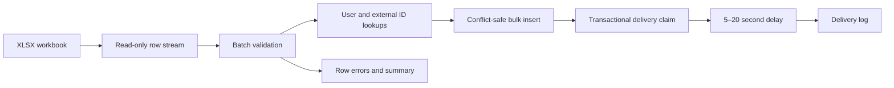

<div align="center">

# Django XLSX Mailing Import

**A memory-efficient command for idempotent XLSX mailing imports and traceable delivery.**

**English** · [Русский](README.ru.md)

[](https://github.com/IgorNadein/django-xlsx-mail-import/actions/workflows/ci.yml)
[](https://github.com/IgorNadein/django-xlsx-mail-import/releases)
[](https://www.python.org/)
[](https://www.djangoproject.com/)
[](https://www.postgresql.org/)
[](LICENSE)

</div>

The command imports mailing jobs from an XLSX workbook, validates every row, and
logs delivery after the required random delay. Streaming workbook reads, batched
queries, bulk inserts, and database constraints keep the flow predictable for large
files and repeated imports.

## At a glance

| Area | Implementation |
|---|---|
| Entry point | Django management command, `import_mailings` |
| Input | Streaming `.xlsx` reader powered by openpyxl |
| Idempotency | Unique `external_id`, in-file deduplication, conflict-safe inserts |
| Delivery | Transactional claim, 5–20 second delay, structured log message |
| Data | PostgreSQL in Docker; SQLite for zero-configuration local use |
| Quality | 10 tests, Ruff, mypy, Django system checks, GitHub Actions |
| Runtime | Docker Compose, PostgreSQL 17, Gunicorn |

## Import rules

- The first row must contain every required header.
- Header order does not matter, and additional columns are allowed.
- `external_id`, `user_id`, `email`, `subject`, and `message` are required.
- `user_id` must reference an existing Django user.
- `email` must be syntactically valid.
- Blank rows are ignored.
- An invalid row is reported with its XLSX row number without stopping the import.
- A repeated `external_id` is skipped and never delivered twice.

## Processing flow



## Quick start

### SQLite

Python 3.10 or newer and [uv](https://docs.astral.sh/uv/) are required.

```bash
uv sync --group dev
uv run python manage.py migrate
uv run python manage.py seed_demo_users
uv run python manage.py generate_sample_xlsx samples/mailings.xlsx
uv run python manage.py import_mailings samples/mailings.xlsx
```

The command really waits 5–20 seconds before logging each message, as required by
the assignment. Use `--no-send` to exercise only the import stage:

```bash
uv run python manage.py import_mailings samples/mailings.xlsx --no-send --batch-size 500
```

### PostgreSQL and Docker

```bash
docker compose up --build --wait
docker compose exec web python manage.py seed_demo_users
docker compose exec web python manage.py generate_sample_xlsx /tmp/mailings.xlsx
docker compose exec web python manage.py import_mailings /tmp/mailings.xlsx
```

The container is exposed at `http://127.0.0.1:8016`. Workbooks placed in
`samples/` are available read-only at `/data` inside the container.

## XLSX example

| external_id | user_id | email | subject | message |
|---|---:|---|---|---|
| `welcome-001` | `1` | `alice@example.com` | `Welcome` | `Hello, Alice!` |
| `digest-002` | `2` | `bob@example.com` | `Weekly digest` | `Your report is ready.` |

Example command result:

```text
Import run: 43ffde16-7f4f-4ac2-a250-44928c9e7f2f
Processed rows: 2
Created records: 2
Skipped records: 0
Erroneous rows: 0
Sent messages: 2
Delivery failures: 0
```

## Architecture

```text
config/                       Django settings, routing and health endpoint
mailings/
├── models.py                 Import audit and mailing delivery states
├── services.py               Streaming import, validation and delivery flow
├── admin.py                  Read-only operational overview
├── management/commands/
│   ├── import_mailings.py    Main XLSX import command
│   ├── seed_demo_users.py    Deterministic demo users
│   └── generate_sample_xlsx.py
├── migrations/               Database schema
└── tests/                    Import, idempotency and delivery scenarios
```

`ImportRun` records the source filename, timestamps, status, and counters.
`MailingRecord` stores the source identifier, recipient, content, owning import, and
delivery state. The service layer owns XLSX parsing and the complete import use case;
the management command is a thin console adapter.

## Idempotency and concurrency

`external_id` has a unique database constraint. Each batch first checks known IDs
and then uses `bulk_create(ignore_conflicts=True)`, so a concurrent command winning
the same insert race still leaves only one record. Duplicates inside one workbook
and across batches are counted as skipped.

Delivery states are `pending`, `processing`, `sent`, and `failed`. A pending record
is claimed under `transaction.atomic()` and `select_for_update()` before delivery.
Only records created by the current import run are sent, so re-importing an old file
does not resend earlier messages.

## Large-file behavior

Openpyxl reads the workbook in `read_only` mode. Memory use is proportional to
`--batch-size`, rather than the full workbook size. Every batch performs set-based
queries for users and existing identifiers, followed by one bulk insert. Delivery
uses a database iterator instead of materializing all created IDs.

## Quality checks

```bash
make check
```

This runs:

```bash
uv run ruff check .
uv run ruff format --check .
uv run mypy .
uv run pytest
uv run python manage.py check
uv run python manage.py makemigrations --check --dry-run
```

Tests replace the real wait while asserting that production delivery chooses and
uses a delay in the required 5–20 second range. GitHub Actions executes the checks
on Python 3.10 and 3.12.

## Assumptions

- Email delivery is intentionally represented by a delayed log message.
- Row-level validation errors do not roll back other valid rows.
- A failed delivery is stored for operational inspection and is not retried by this command.
- A production email provider would normally be connected through an outbox and asynchronous workers.

## License

Distributed under the [MIT License](LICENSE).
