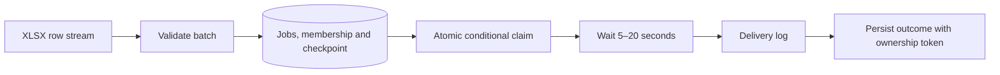

<div align="center">

# Django XLSX Mailing Import

**A memory-efficient command for idempotent XLSX mailing imports and traceable delivery.**

**English** · [Русский](README.ru.md)

[](https://github.com/IgorNadein/django-xlsx-mail-import/actions/workflows/ci.yml)
[](https://github.com/IgorNadein/django-xlsx-mail-import/releases)
[](https://www.python.org/)
[](https://www.djangoproject.com/)
[](https://www.postgresql.org/)
[](LICENSE)

</div>

Import an XLSX workbook into durable mailing jobs, then resume their delivery after
interruptions. The transport logs each message after a random **5–20 second wait**,
as required by the assignment. No real email is sent.

## At a glance

| Area | Implementation |
|---|---|
| Commands | `import_mailings` to import; `send_mailings` to resume saved jobs |
| Input | openpyxl read-only reader, validation and database batches |
| Deduplication | Unique `external_id`, conflict-safe inserts, immutable saved payload |
| Delivery | Atomic claim with ownership token; explicit recovery of unknown outcomes |
| Data | PostgreSQL 17 in Docker; SQLite for local use |
| Quality | 30 tests on PostgreSQL, SQLite suite, Ruff, strict mypy, migration checks |
| Evidence | [Reproducible 10k / 100k-row benchmark](docs/benchmark.md) |

## Quick start

Python 3.10+ and [uv](https://docs.astral.sh/uv/) are required.

```bash
uv sync --dev --locked
uv run python manage.py migrate
uv run python manage.py seed_demo_users
uv run python manage.py generate_sample_xlsx samples/mailings.xlsx
uv run python manage.py import_mailings samples/mailings.xlsx
```

The sample has two messages; delivery really waits 5–20 seconds **per message**.
Import alone is fast and can be followed by delivery later:

```bash
uv run python manage.py import_mailings samples/mailings.xlsx --no-send --batch-size 500
# Copy the UUID printed as "Import run":
uv run python manage.py send_mailings --run <UUID>
```

Re-running either the original import or `send_mailings` sends remaining `pending`
jobs. Records already marked `sent` are not sent again. A row counted as `skipped`
can still reference a pending job from an earlier import.

### PostgreSQL and Docker

```bash
docker compose up --build --wait
docker compose exec web python manage.py seed_demo_users
docker compose exec web python manage.py generate_sample_xlsx /tmp/mailings.xlsx
docker compose exec web python manage.py import_mailings /tmp/mailings.xlsx
```

The web/health endpoint is at `http://127.0.0.1:8016`. Files in `samples/` are
mounted read-only at `/data`. Docker installs runtime dependencies from `uv.lock`.
For an existing v0.1 database, run `python manage.py migrate` before starting workers.
The migration preserves jobs, links old jobs to their import runs and marks old
unowned `processing` jobs as `uncertain`.

## XLSX contract

| external_id | user_id | email | subject | message |
|---|---:|---|---|---|
| `welcome-001` | `1` | `alice@example.com` | `Welcome` | `Hello, Alice!` |
| `digest-002` | `2` | `bob@example.com` | `Weekly digest` | `Your report is ready.` |

- The first row contains all five headers; order and case do not matter. Extra
  columns are allowed, duplicate headers are rejected. The active sheet is imported.
- Fields are required; email is validated, and `user_id` must reference an existing
  default Django user (integer 1–2,147,483,647).
- Entirely blank rows are ignored. Errors include the XLSX row number and do not
  discard valid rows. `processed = created + skipped + errors`.
- A stored `external_id` keeps its original payload. Repeated IDs are not updates.
  Within a batch, the first syntactically valid occurrence is considered for insertion.
- Batch size is 1–1,000 (default 500). Each committed batch persists its counters,
  jobs and file membership atomically; a failed later batch retains earlier progress.

```text
Import run: 43ffde16-7f4f-4ac2-a250-44928c9e7f2f
Processed rows: 2
Created records: 2
Skipped records: 0
Erroneous rows: 0
Sent messages: 2
Delivery failures: 0
Current delivery states for this file: {'pending': 0, 'processing': 0, 'sent': 2, 'failed': 0, 'uncertain': 0}
```

## Architecture



```text
mailings/
├── models.py                 ImportRun, MailingRecord, ImportEntry and constraints
├── services.py               XLSX validation and batched import transactions
├── delivery.py               Claims, delivery and recovery state machine
├── management/commands/
│   ├── import_mailings.py    Import, then deliver pending jobs in this file
│   └── send_mailings.py      Drain saved jobs without reading XLSX again
├── migrations/               Schema and v0.1 data upgrade
└── tests/                    Validation, recovery, migrations and concurrency
scripts/benchmark_import.py   Isolated synthetic workload
```

`ImportEntry` links every import to all jobs represented by its valid rows,
including already-existing jobs. This enables recovery after `--no-send` or a
partial previous delivery. Import counters describe the input; delivery totals
are computed from current linked job states, so they stay accurate after recovery.
`imported` means the file has been read, not that all messages have been sent.

## Delivery and recovery

| State | Meaning | Next step |
|---|---|---|
| `pending` | Not yet sent | Ordinary invocation |
| `processing` | A worker owns a claim | Let that worker finish |
| `sent` | Delivery logged and success saved | Never selected for retry |
| `failed` | Transport can prove no side effect occurred | Explicit `--retry-failed` |
| `uncertain` | An interruption/error left the outcome unknown | Reconcile first; explicit `--retry-uncertain` |

```bash
uv run python manage.py send_mailings --run <UUID> --limit 100
uv run python manage.py send_mailings --run <UUID> --retry-failed
# Only after checking the outcome and stopping previous workers:
uv run python manage.py send_mailings --run <UUID> --retry-uncertain
```

Ctrl+C during the simulated sleep safely returns that job to `pending`. An
interrupt at the delivery boundary becomes `uncertain`. A hard-killed process can
leave `processing`; `--retry-uncertain` also accepts claims older than five minutes.
This flag can duplicate a message whose side effect succeeded before the crash.
There is deliberately no claim of exactly-once delivery across a database and an
external transport. A real provider needs an idempotency key or reconciliation API.

Claims use one conditional `UPDATE`; no transaction or row lock stays open during
the wait or transport call. A unique token prevents an old worker from overwriting
a newer attempt's state. On PostgreSQL, several `send_mailings --run <UUID>` processes
may drain the same run concurrently. They claim different jobs; each process is a
finite worker, not a scheduler. SQLite is intended for local, single-worker use.

## Large files and tradeoffs

Rows are streamed and per-batch objects are bounded. Database work uses set-based
lookups and bulk writes; delivery scans bounded pages of IDs. However, openpyxl
still loads shared-string/style metadata, so memory is not strictly O(batch size)
for every possible XLSX file. See [benchmark method and results](docs/benchmark.md).

Sending remains intentionally slow: one worker waits 5–20 seconds per message.
The benchmark measures **import only**, without waits or delivery. Durable database
jobs keep parsing separate from sending without adding Redis/Celery for this task.
Automatic backoff, a scheduler, real mail delivery and log retention are outside
scope. The mock log contains recipient and message content; use synthetic input.

## Quality checks

```bash
make check
```

Runs Ruff lint/format, strict mypy, pytest, Django system checks and migration drift
checks. CI runs on Python 3.10 and 3.12 with SQLite and a separate PostgreSQL 17 job.
The PostgreSQL suite includes competing imports, competing claims, simultaneous
independent deliveries and migration from the old schema. SQLite skips the three
PostgreSQL concurrency tests rather than pretending to test row-level locking.

Run the entire suite against a disposable PostgreSQL instance:

```bash
POSTGRES_HOST=127.0.0.1 POSTGRES_PORT=5432 POSTGRES_DB=mailings \
POSTGRES_USER=mailings POSTGRES_PASSWORD=mailings uv run pytest
```

The database role needs permission to create the temporary test database. Tests
mock waiting but assert that the production transport requests the required delay.

## License

Distributed under the [MIT License](LICENSE).
