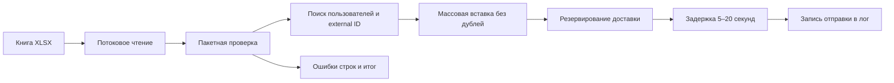

<div align="center">

# Django XLSX Mailing Import

**Экономный по памяти импорт XLSX-рассылок с защитой от дублей и журналом доставки.**

[English](README.md) · **Русский**

[](https://github.com/IgorNadein/django-xlsx-mail-import/actions/workflows/ci.yml)
[](https://github.com/IgorNadein/django-xlsx-mail-import/releases)
[](https://www.python.org/)
[](https://www.djangoproject.com/)
[](https://www.postgresql.org/)
[](LICENSE)

</div>

Команда импортирует задания на рассылку из XLSX, проверяет каждую строку и записывает
отправку в лог после обязательной случайной задержки. Потоковое чтение, пакетные
запросы, массовые вставки и ограничения базы обеспечивают предсказуемую обработку
больших файлов и повторных импортов.

## Краткий обзор

| Область | Реализация |
|---|---|
| Точка входа | Django management command `import_mailings` |
| Входные данные | Потоковое чтение `.xlsx` через openpyxl |
| Идемпотентность | Уникальный `external_id`, удаление дублей, безопасная вставка |
| Доставка | Транзакционное резервирование, задержка 5–20 секунд, логирование |
| Данные | PostgreSQL в Docker; SQLite для локального запуска без настройки |
| Качество | 10 тестов, Ruff, mypy, Django system checks, GitHub Actions |
| Запуск | Docker Compose, PostgreSQL 17, Gunicorn |

## Правила импорта

- Первая строка должна содержать все обязательные заголовки.
- Порядок колонок не важен, дополнительные колонки разрешены.
- Поля `external_id`, `user_id`, `email`, `subject` и `message` обязательны.
- `user_id` должен указывать на существующего пользователя Django.
- `email` должен иметь корректный формат.
- Пустые строки игнорируются.
- Ошибка выводится с номером строки XLSX и не останавливает остальной импорт.
- Повторный `external_id` пропускается и не отправляется ещё раз.

## Обработка файла



## Быстрый запуск

### SQLite

Требуются Python 3.10 или новее и [uv](https://docs.astral.sh/uv/).

```bash
uv sync --group dev
uv run python manage.py migrate
uv run python manage.py seed_demo_users
uv run python manage.py generate_sample_xlsx samples/mailings.xlsx
uv run python manage.py import_mailings samples/mailings.xlsx
```

Команда действительно ждёт 5–20 секунд перед записью каждого письма в лог, как
требуется в задании. Флаг `--no-send` позволяет проверить только импорт:

```bash
uv run python manage.py import_mailings samples/mailings.xlsx --no-send --batch-size 500
```

### PostgreSQL и Docker

```bash
docker compose up --build --wait
docker compose exec web python manage.py seed_demo_users
docker compose exec web python manage.py generate_sample_xlsx /tmp/mailings.xlsx
docker compose exec web python manage.py import_mailings /tmp/mailings.xlsx
```

Контейнер доступен по адресу `http://127.0.0.1:8016`. Файлы из каталога `samples/`
видны внутри контейнера только для чтения по пути `/data`.

## Пример XLSX

| external_id | user_id | email | subject | message |
|---|---:|---|---|---|
| `welcome-001` | `1` | `alice@example.com` | `Welcome` | `Hello, Alice!` |
| `digest-002` | `2` | `bob@example.com` | `Weekly digest` | `Your report is ready.` |

Пример результата команды:

```text
Import run: 43ffde16-7f4f-4ac2-a250-44928c9e7f2f
Processed rows: 2
Created records: 2
Skipped records: 0
Erroneous rows: 0
Sent messages: 2
Delivery failures: 0
```

## Архитектура

```text
config/                       Настройки Django, маршруты и health endpoint
mailings/
├── models.py                 Журнал импорта и статусы доставки
├── services.py               Потоковый импорт, валидация и доставка
├── admin.py                  Операционный обзор данных
├── management/commands/
│   ├── import_mailings.py    Основная команда импорта XLSX
│   ├── seed_demo_users.py    Детерминированные тестовые пользователи
│   └── generate_sample_xlsx.py
├── migrations/               Схема базы данных
└── tests/                    Импорт, идемпотентность и доставка
```

`ImportRun` хранит имя файла, время, статус и итоговые счётчики. `MailingRecord`
хранит внешний идентификатор, получателя, содержание, запуск импорта и состояние
доставки. Сервисный слой отвечает за XLSX и весь сценарий обработки, а management
command служит тонким консольным адаптером.

## Идемпотентность и конкуренция

Для `external_id` задано уникальное ограничение базы. Каждый пакет сначала проверяет
известные идентификаторы, а затем вызывает `bulk_create(ignore_conflicts=True)`.
Даже если две команды одновременно вставляют одну запись, в базе останется один
экземпляр. Дубли внутри книги и между пакетами учитываются как пропущенные.

Статусы доставки: `pending`, `processing`, `sent` и `failed`. Запись резервируется
внутри `transaction.atomic()` через `select_for_update()`. Отправляются только записи
текущего запуска, поэтому повторный импорт старого файла не дублирует письма.

## Работа с большими файлами

Openpyxl открывает книгу в режиме `read_only`, поэтому потребление памяти зависит от
`--batch-size`, а не от размера всей книги. Для каждого пакета выполняются групповые
запросы пользователей и внешних идентификаторов, затем одна массовая вставка.
Доставка перебирает записи через итератор базы данных.

## Проверки качества

```bash
make check
```

Команда выполняет:

```bash
uv run ruff check .
uv run ruff format --check .
uv run mypy .
uv run pytest
uv run python manage.py check
uv run python manage.py makemigrations --check --dry-run
```

В тестах реальное ожидание подменяется, но отдельно проверяется выбор и применение
задержки от 5 до 20 секунд. GitHub Actions запускает проверки на Python 3.10 и 3.12.

## Допущения

- Доставка намеренно представлена записью в лог после задержки.
- Ошибка отдельной строки не откатывает остальные корректные строки.
- Неудачная доставка сохраняется для проверки и не повторяется этой командой.
- В реальной системе почтовый провайдер обычно подключается через outbox и фоновые воркеры.

## Лицензия

Проект распространяется по [лицензии MIT](LICENSE).
