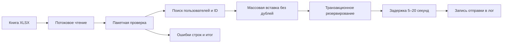

# Импорт XLSX-рассылок в Django

[](https://github.com/IgorNadein/django-xlsx-mail-import/actions/workflows/ci.yml)
[](https://www.python.org/)
[](https://www.djangoproject.com/)
[](LICENSE)

[English version](README.md)

Проект содержит Django management command для импорта рассылок из XLSX и имитации отправки письма записью в лог после обязательной случайной задержки. Решение рассчитано на большие файлы: книга читается в потоковом режиме, валидация и запросы к базе выполняются пакетами, а созданные записи перебираются через итератор базы данных.

## Что реализовано

- проверка структуры книги и каждой непустой строки;
- пакетная проверка существования пользователей без N+1-запросов;
- идемпотентность за счёт уникального ограничения `external_id` в базе данных;
- обработка дублей внутри одного файла и при повторном импорте;
- пакетное создание корректных записей;
- продолжение импорта после ошибочной строки с выводом её номера;
- журнал запусков импорта, счётчики и статусы доставки;
- транзакционное резервирование записи перед отправкой;
- запись отправки в лог после случайной задержки от 5 до 20 секунд;
- SQLite для простого локального запуска и PostgreSQL через переменные окружения;
- Django Admin, Docker Compose, статический анализ и тесты.

## Модель данных

`ImportRun` хранит имя исходного файла, время, статус и итоговые счётчики. `MailingRecord` хранит внешний идентификатор, пользователя, адрес, содержание письма, запуск импорта и статус доставки.

Поле `external_id` уникально на уровне базы. Это защищает от дублей даже при одновременном запуске двух команд. При конкурентной вставке `bulk_create(ignore_conflicts=True)` оставляет одну запись и позволяет импорту продолжиться.

Статусы доставки: `pending`, `processing`, `sent`, `failed`. Команда отправляет только записи, созданные текущим запуском, поэтому повторный импорт старого файла не отправляет письма ещё раз.



## Формат XLSX

Первая строка должна содержать следующие заголовки. Порядок колонок не важен, дополнительные колонки разрешены.

| Колонка | Назначение |
| --- | --- |
| `external_id` | Уникальный идентификатор во внешней системе, до 128 символов |
| `user_id` | Идентификатор существующего пользователя Django |
| `email` | Email получателя |
| `subject` | Тема письма, до 255 символов |
| `message` | Текст письма |

Пустые строки игнорируются. Ошибочная строка учитывается в статистике и не останавливает обработку остальных данных.

## Локальный запуск с SQLite

Нужен Python 3.10 или новее. В примерах используется [uv](https://docs.astral.sh/uv/), но проект можно установить и обычным `pip`.

```bash
uv sync --group dev
uv run python manage.py migrate
uv run python manage.py seed_demo_users
uv run python manage.py generate_sample_xlsx samples/mailings.xlsx
uv run python manage.py import_mailings samples/mailings.xlsx
```

Обычный запуск действительно ждёт 5–20 секунд перед записью каждого письма в лог — это требование задания. Для проверки только импорта есть флаг `--no-send`:

```bash
uv run python manage.py import_mailings samples/mailings.xlsx --no-send --batch-size 500
```

Пример результата:

```text
Import run: 43ffde16-7f4f-4ac2-a250-44928c9e7f2f
Processed rows: 2
Created records: 2
Skipped records: 0
Erroneous rows: 0
Sent messages: 2
Delivery failures: 0
```

При необходимости записи можно посмотреть в Django Admin:

```bash
uv run python manage.py createsuperuser
uv run python manage.py runserver
```

Проверка состояния приложения доступна по адресу `GET /health/`.

## PostgreSQL и Docker

```bash
docker compose up --build --wait
docker compose exec web python manage.py seed_demo_users
docker compose exec web python manage.py generate_sample_xlsx /tmp/mailings.xlsx
docker compose exec web python manage.py import_mailings /tmp/mailings.xlsx
```

Приложение откроется на <http://localhost:8016>. Свои книги можно положить в `samples/`: внутри контейнера этот каталог доступен только для чтения как `/data`. Для остановки выполните `docker compose down`; флаг `-v` также удалит том базы данных.

## Проверки качества

```bash
uv run pytest
uv run ruff check .
uv run ruff format --check .
uv run mypy .
uv run python manage.py check
uv run python manage.py makemigrations --check --dry-run
```

В тестах реальное ожидание подменяется, но отдельно проверяется, что рабочая функция выбирает задержку в диапазоне 5–20 секунд и вызывает `sleep`.

## Особенности надёжности

Openpyxl открывает XLSX в режиме `read_only`, поэтому содержимое всей книги не загружается в память. Объём рабочей памяти зависит от `--batch-size`. На пакет выполняются групповые запросы существующих пользователей и внешних идентификаторов, после чего записи создаются одной массовой вставкой.

Имитация отправки сделана синхронно, как указано в задании. В реальном сервисе импорт записывал бы задачи в транзакционный outbox, а отдельные воркеры отправляли бы письма асинхронно с повторными попытками и ключом идемпотентности у почтового провайдера.

При обычной работе транзакционное резервирование не позволяет двум воркерам одновременно взять одну запись. Если процесс завершится после фактической отправки, но до сохранения статуса `sent`, запись останется в `processing`. В промышленной реализации этот разрыв закрывается outbox-паттерном и идемпотентностью провайдера.

## Лицензия

[MIT](LICENSE)
